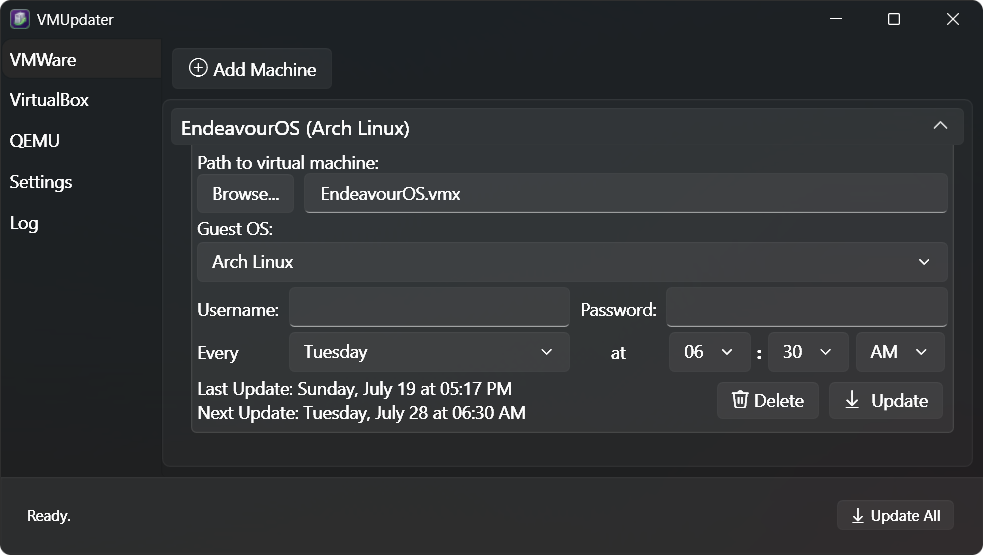

#  VMUpdater

A Windows desktop application that automates scheduled, headless system updates across multiple virtual machines — supporting VMware Workstation, VirtualBox, and QEMU.



## Overview

VMUpdater manages a list of VMs, each with its own hypervisor type, guest OS, credentials, and weekly update schedule. At the scheduled time it headlessly boots the VM, verifies network connectivity from inside the guest, runs the appropriate package manager upgrade, then cleanly shuts the VM back down — all without any user interaction.

## Features

- **Multi-VM Management** — Add, configure, and independently schedule as many VMs as you need.
- **Multi-Hypervisor Support** — Works with VMware Workstation (`vmrun`), VirtualBox (`VBoxManage`), and QEMU.
- **Multi-OS Support** — Runs the correct upgrade command per guest OS (Arch Linux `pacman`, Ubuntu `apt-get`).
- **Scheduled Updates** — Per-VM weekly schedule (day + time), calculated and displayed as *Next Update*.
- **Manual Trigger** — Force an immediate update for any VM at any time via *Update Now*.
- **Headless Execution** — VMs boot without a GUI and are shut down automatically after the update completes.
- **Network Validation** — Pings `8.8.8.8` from inside the guest before running updates; aborts cleanly on failure.
- **Progress Tracking** — A status bar and progress indicator keep you informed throughout each update.
- **Persistent VM Profiles** — Each VM's configuration is saved as an individual profile in `%AppData%\VMUpdater\`.
- **System Tray Integration** — Minimizes to the system tray and shows live update status in the tooltip.
- **Activity Log** — In-app log tab plus timestamped log files in `Logs\` provide a full audit trail.

## Requirements

- Windows 10/11
- One or more of the following hypervisors installed:

  | Hypervisor | Executable |
  |---|---|
  | [VMware Workstation](https://www.vmware.com/products/workstation-pro.html) | `vmrun.exe` |
  | [VirtualBox](https://www.virtualbox.org/) | `VBoxManage.exe` |
  | [QEMU](https://www.qemu.org/) | QEMU executable |

- Guest OS with `sudo` privileges and a supported package manager (`pacman` or `apt-get`)

## Getting Started

1. **Clone the repository**
   ```bash
   git clone https://github.com/atshaw1994/VMUpdater.git
   ```

2. **Open in Visual Studio 2026** and build the solution.

3. **Set your hypervisor executable paths** in the Settings tab (VMRun, VBoxManage, QEMU).

4. **Add a VM** — Click *Add*, select your hypervisor and guest OS type, browse to the VM file, and enter credentials.

5. **Set a schedule** — Pick a day and time per VM. VMUpdater will handle the rest from the system tray.

## Project Structure

```
VMUpdater/
├── Models/
│   └── VirtualMachineModel.cs      # Per-VM data model & HypervisorType enum
├── Services/
│   └── VirtualMachineService.cs    # Update orchestration, hypervisor strategies, profile persistence
├── ViewModels/
│   ├── MainViewModel.cs            # App-level logic, VM list, commands
│   ├── VirtualMachineViewModel.cs  # Per-VM state, scheduling, browse
│   └── ViewModelBase.cs            # INotifyPropertyChanged base
├── Views/
│   ├── MainWindow.xaml             # Main UI shell
│   ├── VirtualMachineEntry.xaml    # Expandable per-VM card
│   └── TimePicker.xaml             # Custom time picker control
├── Helpers/
│   ├── RelayCommand.cs
│   ├── BooleanToVisibilityConverter.cs
│   ├── InverseBooleanConverter.cs
│   └── DateTimeToPartsConverter.cs
└── Properties/
    └── Settings.settings           # Hypervisor executable paths
```

## Tech Stack

- **.NET 10** / **WPF**
- **MVVM** architecture with a service/strategy layer
- [H.NotifyIcon.Wpf](https://github.com/HavenDV/H.NotifyIcon) — system tray support

## License

This project is open source. See [LICENSE](LICENSE) for details.
