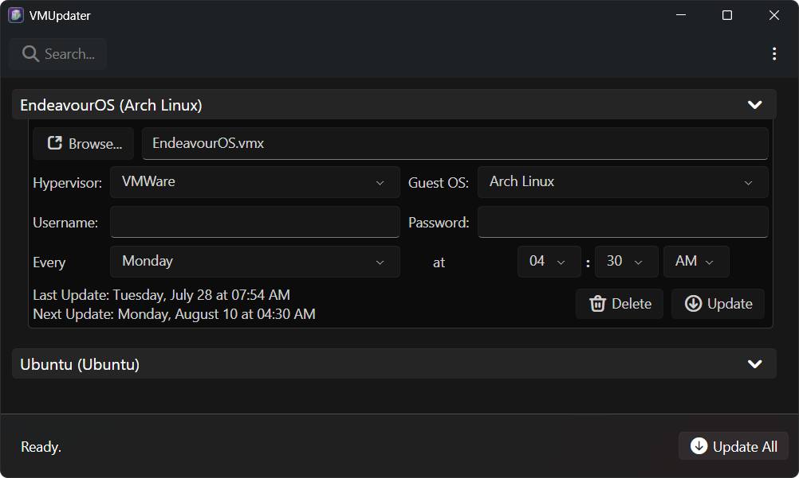

#  VMUpdater

This branch's purpose is to convert the project to use Avalonia UI instead of WPF to allow cross-platform compatibility. The project is still in development, and some features may not be fully implemented yet.

## License

This project is licensed under the **GNU General Public License v3.0**. See [LICENSE](LICENSE) for the full license text.

You are free to use, modify, and distribute this software under the terms of the GPL v3. Any derivative works must also be distributed under the same license.
